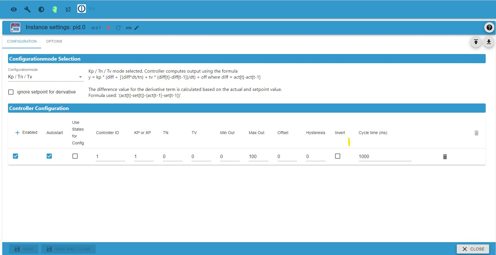
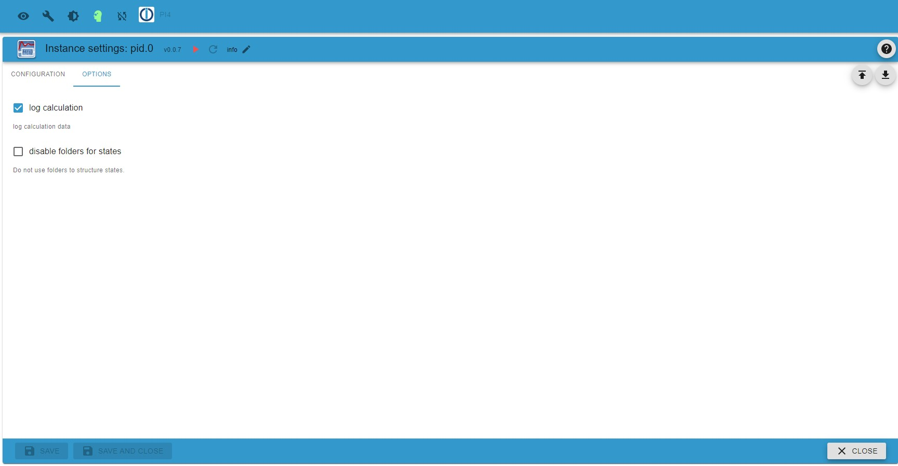

# PID-Adapter-Informationen

## Allgemeine Informationen

Dieser Adapter bietet einen oder mehrere konfigurierbare PID Regler pro Instanz.

Die allgemeine Funktionsweise eines PID Reglers ist z.B. bei wikipedia (deutsch: https://de.wikipedia.org/wiki/Regler, englisch: https://en.wikipedia.org/wiki/PID_controller) dokumentiert. Kurz gesagt berechnet ein PID-Regler einen Ausgangswert in Abhängigkeit von einem Eingangswert und drei Parametern:

- Proportionalanteil
- integraler Anteil
- deriative Komponente

Dieser ioBroker-Adapter erlaubt die Konfiguration des pid-Reglers durch Angabe verschiedener Parameter, die [hier](#regler-konfiguration) aufgeführt sind. Der Ausgangswert wird in regelmäßigen Intervallen berechnet, die als Zykluszeit angegeben werden. Außerdem kann die Berechnung unterbrochen werden und interne Werte können bei Bedarf zurückgesetzt werden.

Als komfortable Funktion kann der Ausgangswert im Handbetrieb auf einen bestimmten Wert gesetzt werden.

Die Zustände, die für den Eingang verwendet und durch den Ausgang des Reglers eingestellt werden, sind im Abschnitt [Beschreibung der Zustände](#beschreibung-der-zustände) aufgeführt.

## Einstellungen

### TAB Konfiguration

Auf dieser Registerkarte können Sie eine oder mehrere Regler-Instanzen anlegen, die unabhängig voneinander arbeiten.

#### Auswahl des Konfigurationsmodus

Folgende Parameter können Sie angeben:

- Konfigurationsmodus  
   Im Feld „Konfigurationsmodus“ kann ausgewählt werden, ob der Kp/Tn/Tv-Modus oder der Xp/tn/Tv-Modus gewünscht wird. Rechts neben der Auswahl sehen Sie die je nach Auswahl zur Berechnung verwendete Formel.

- Sollwert für Ableitung ignorieren  
  Ist dieses Feld aktiviert, wird der Differenzwert für den Differenzialanteil nur aus dem Istwert berechnet, ansonsten wird auch der Sollwert berücksichtigt.

#### Regler-Konfiguration

Diese Tabelle ermöglicht die Konfiguration einer Liste von Reglern

<!-- prettier-ignore-start -->
| Parameter | Typ | Beschreibung | Kommentar |
| ------------------ | ------- | --------------------------------------- | --------------------------------------------------------- |
| Aktiviert | boolesch | Wenn markiert, wird der Regler verwendet | kann verwendet werden, um einen Controller vorübergehend zu deaktivieren |
| Autostart | boolesch | Wenn markiert, wird der Regler immer dann gestartet, wenn der Adapter gestartet wird | Der Regler kann in jedem Fall im `Hold`-Zustand gestoppt und gestartet werden |
| Use States for Config | boolesch | wenn markiert, werden die Parameter durch Zustände gesteuert | Dieses Flag deaktiviert die Parameterfelder, wenn es ausgewählt ist |
| Regler-Id | Text | Regler-Id zur Identifizierung eines Reglers | Diese ID muss für alle Regler eindeutig sein, kann aber vom Benutzer ausgewählt werden |
| Kp oder Xp | Zahl | Proportionaler Term des Reglers | Angabe eines Dezimalteils ist möglich |
| Tn | Zahl | integraler Begriff des Reglers | Angabe eines Dezimalteils möglich |
| Tv | Zahl | deriativer Begriff des Reglers | Angabe eines Dezimalteils möglich |
| Min Out | Zahl | minimaler Ausgangswert |
| Max Out | Zahl | maximaler Ausgangswert |
| Offset | Zahl | Offset addiert zum Ausgangswert |
| Hysterese | Zahl | Hysteresewert | Ausgabe ändert sich nicht, solange die Differenz kleiner als die Hysterese ist |
| Invertieren | boolesch | invertiert den Ausgabewert | |
| Zykluszeit (ss) | Ganzzahl | Zykluszeit in ms | gibt die Zykluszeit für wiederkehrende Berechnungen an. Die Zykluszeit ist auf 100 - 3600000ms begrenzt. |
<!-- prettier-ignore-end -->

### TAB Allgemeine Optionen

Hier legen Sie einige allgemeine Optionen fest.

- Protokollberechnung  
     Das Setzen dieser Option aktiviert die Protokollierung von Daten, die während regelmäßiger Neuberechnungen berechnet werden.

- Ordner für Zustände deaktivieren  
     Normalerweise werden Zustände über Ordner strukturiert. Wenn eine flache Struktur bevorzugt wird, deaktiviert die Aktivierung dieser Option alle Ordner. Bitte beachten Sie, dass durch das Ändern dieser Option alle vorhandenen Zustände gelöscht werden. Dies kann Nebenwirkungen haben, z. B. im Zusammenhang mit der Verlaufsaufzeichnung. Daher muss eine Warnung bestätigt werden, bevor diese Option geändert werden kann.
    
## Details der Funktionalität

### Beschreibung der Zustände

Jede Adapterinstanz erzeugt einen Satz von Zuständen pro konfiguriertem Regler. Die folgende Tabelle beschreibt den Inhalt dieser Zustände und ob sie schreibgeschützt (RO) oder für den Benutzer beschreibbar (RW) sind.

<!-- prettier-ignore-start -->
| Ordner | Zustand | Typ | RW/RO | Beschreibung |
| ----------- | ----------- | ------- | ----- | ------------------------------------------------------------------------------------------- |
| cfg | cycle | number | RO | cycle time in ms wie unter config konfiguriert (*) |
| cfg | dao | boolean | RO | true zeigt an, dass deriavative nur act input verwendet |
| cfg | inv | boolean | RO | true gibt an, dass die Ausgabe invertiert wird |
| cfg | useXp | boolean | RO | true gibt an, dass der Xp/Tn/Tv-Modus verwendet wird |
| | | | | |
| in | act | number | RW | aktueller Wert als Eingang zum Regler |
| in | hold | boolean | RW | Flagge zum Anhalten der Verarbeitung |
| in | man | boolean | RW | Flagge zur Aktivierung des manuellen Modus; true aktiviert den manuellen Modus |
| in | man_inp | number | RW | manueller Eingabewert, der an 'y' ausgegeben wird, wenn 'man' auf true gesetzt ist |
| in | rst | boolean | RW | Trigger zum Initialisieren eines Reset des Reglers (Schreiben von true setzt den Regler zurück) |
| in | set | number | RW | Sollwert als Eingang zum Regler |
| | | | | |
| out | diff | number | RO | Differenz zwischen Istwert ('act') und Sollwert ('set') im letzten Zyklus |
| out | lim | boolean | RO | Indikator wird auf true gesetzt, wenn der Reglerausgang im letzten Zyklus die Grenzwerte erreicht hat |
| out | supr | boolean | RO | Indikator wird auf true gesetzt, wenn der Regler den Eingang aufgrund der supr (Hysterese) Grenze ignoriert hat |
| out | y | Zahl | RO | Ausgangswert des Reglers, der als Rückmeldung an das System verwendet wird |
| | | | | |
| para | kp | number | RW | Proportionalfaktor, konfiguriert bei config (*) |
| para | max | number | RW | Maximaler Wert für den Ausgang oder Null als Faktor, konfiguriert in der Konfiguration (*) |
| para | min | number | RW | Minimalwert für den Ausgang oder Null als Faktor, konfiguriert in der Konfiguration (*) |
| para | off | number | RW | statis coffset value to be added to output ('y') |
| para | sup | Zahl | RW | Unterdrückung / Hysteresewert |
| para | tn | Zahl | RW | Integralwert, konfiguriert in der Konfiguration (*) |
| para | tv | number | RW | deriative term konfiguriert in config (*) |
| para | xp | Zahl | RW | Proportionalitätsfaktor konfiguriert in der Konfiguration (*) |
| | | | | |
| xtra | i_differr | number | RO | interne Differenz, die zur Berechnung des D-Terms im letzten Zyklus verwendet wird |
| xtra | i_sumerr | number | RO | interner kumulierter Fehler, der für die Berechnung des P-Terms im letzten Zyklus verwendet wird |
| xtra | last_delta | number | RO | Zeit zwischen den letzten Zyklen (ms) |
| xtra | last_upd | number | RO | Zeitstempel (ms seit Epoche) des letzten iupdate-Zyklus |
| xtra | run | boolean | RO | wird auf true gesetzt, wenn der Regler in Betrieb ist. Wird 'run' auf false gesetzt, werden die Berechnungen ausgesetzt |
| | | | | |                               |
<!-- prettier-ignore-end -->

### Hysteresebehandlung und Aktualisierung des Ausgangs

Der Adapter wertet jeden Eingang aus, der in den Zustand 'act' geschrieben wird und berechnet die Differenz zu 'set'. Wenn die Differenz kleiner als der Hysteresewert ist, wird keine Neuberechnung durchgeführt. Dadurch werden kleine Änderungen am Ausgang reduziert, wenn sich 'act' nur geringfügig ändert.

Wenn der Adapterkontrollzustand 'hold' auf true gesetzt ist, wird keine neue Berechnung durchgeführt. Der Ausgang wird eingefroren ('on-hold'), während 'hold' auf true gesetzt ist.

Wenn eine Zykluszeit ungleich Null konfiguriert ist (und 'hold' falsch ist), führt der Adapter alle x ms eine Neuberechnung durch, die durch 'cycle' festgelegt wird. Das Ergebnis der Berechnung wird in die entsprechenden Zustände geschrieben. Sie können auch die internen Werte überprüfen.
